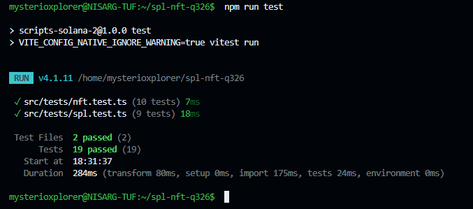

# SPL Token & NFT Scripts — Solana Devnet

Scripts for minting SPL tokens, attaching on-chain metadata, and creating/managing NFTs using MPL Core on Solana devnet.

---

## Setup

### 1. Add your wallet

Place your devnet wallet keypair at the project root:

```
root/
└── devnet-wallet.json   ← JSON array of secret-key bytes, e.g. [174, 23, ...]
```

Fund it with devnet SOL:

```bash
solana airdrop 2 <YOUR_WALLET_ADDRESS> --url devnet
```

### 2. Install dependencies

```bash
npm install
```

### 3. Add your NFT image

Place a PNG image here for the NFT scripts:

```
src/nft/
└── nft pic.png
```

---

## References

Before running scripts, review these docs:

- [Solana Token Docs](https://solana.com/docs/tokens) — mint accounts, token accounts, ATAs
- [Solana Kit](https://www.solanakit.com/) — JS SDK for building and sending transactions
- [Metaplex Token Metadata](https://developers.metaplex.com/token-metadata) — on-chain metadata for SPL tokens
- [Metaplex Core](https://developers.metaplex.com/core) — NFT standard used in the NFT scripts

---

## Task 1 — Mint and Transfer an SPL Token

Uses **@solana/kit** and **@solana-program/token** for transactions; **mpl-token-metadata** via UMI for on-chain metadata.

| Script | Command | What it does |
|---|---|---|
| `spl_init.ts` | `npm run spl:init` | Creates a new mint account; logs the mint address |
| `spl_metadata.ts` | `npm run spl:metadata` | Attaches name (`NisargXplores Token`), symbol (`NXT`), and URI to the mint |
| `spl_mint.ts` | `npm run spl:mint` | Creates your ATA and mints 100 tokens into it |
| `spl_transfer.ts` | `npm run spl:transfer` | Creates the recipient's ATA and transfers 1 token |

**Run in order.** After `spl:init`, paste the printed mint address into `spl_metadata.ts`, `spl_mint.ts`, and `spl_transfer.ts` before running each.

### How it works

1. `spl_init` creates a **mint account** (the factory that controls the token supply) and sets `decimals: 6`.
2. `spl_metadata` calls `createMetadataAccountV3` via the Token Metadata program to attach a human-readable name/symbol to the mint.
3. `spl_mint` derives the sender's **Associated Token Account (ATA)** via `findAssociatedTokenPda`, creates it, then calls `getMintToInstruction` to mint 100 tokens (100 × 10⁶ raw units).
4. `spl_transfer` derives both ATAs, creates the recipient's ATA if it doesn't exist, then calls `getTransferCheckedInstruction` to move 1 token.

---

## Task 2 — Mint an NFT (MPL Core)

Uses **mpl-core** via UMI. Images and metadata are stored on Irys (decentralised storage).

| Script | Command | What it does |
|---|---|---|
| `nft_image.ts` | `npm run nft:image` | Uploads your PNG to Irys; logs the image URI |
| `nft_metadata.ts` | `npm run nft:metadata` | Builds the metadata JSON and uploads it; logs the metadata URI |
| `nft_mint.ts` | `npm run nft:mint` | Mints the NFT on-chain using the metadata URI; logs the asset address |

**Run in order.** Paste the URI printed by each step into the next script.

**Minted NFT:** [GtcD7udReiKqAE3MrwJs9ZjdoZBQkZHVQx4AxpiXEFmi](https://explorer.solana.com/address/GtcD7udReiKqAE3MrwJs9ZjdoZBQkZHVQx4AxpiXEFmi?cluster=devnet)

### How it works

MPL Core stores an NFT as a single **Asset account** (no separate mint/token accounts). The `create` instruction sets the owner, name, and off-chain metadata URI in one transaction.

---

## Task 3 — Update NFT Metadata

| Script | Command | What it does |
|---|---|---|
| `nft_update.ts` | `npm run nft:update` | Updates the asset name to `NisargXplores V2` and sets a new URI |

Before running, paste the asset address (printed by `nft:mint`) into `nft_update.ts`:

```typescript
const assetAddress = publicKey("YOUR_ASSET_ADDRESS_HERE");
```

The wallet must be the **update authority** of the asset (the wallet that minted it is the update authority by default).

### How it works

`fetchAsset` loads the current on-chain state, then `update` sends a transaction that replaces the name and URI fields. Only the update authority can call this.

---

## Extension Challenges

### 4 & 5 — Transfer NFT Ownership

| Script | Command | What it does |
|---|---|---|
| `nft_transfer.ts` | `npm run nft:transfer` | Transfers ownership of the asset to a new wallet |

Before running, paste the asset address into `nft_transfer.ts`:

```typescript
const assetAddress = publicKey("YOUR_ASSET_ADDRESS_HERE");
const newOwner    = publicKey("RECIPIENT_WALLET_ADDRESS");
```

### 6 — Burn NFT and Reclaim Rent

| Script | Command | What it does |
|---|---|---|
| `nft_burn.ts` | `npm run nft:burn` | Permanently destroys the asset and returns the rent lamports to the owner |

Before running, paste the asset address into `nft_burn.ts`:

```typescript
const assetAddress = publicKey("YOUR_ASSET_ADDRESS_HERE");
```

> **Warning:** Burning is irreversible. The asset account is closed and rent is returned to the current owner.

---

## Testing

Unit tests live in `src/tests/` and use [Vitest](https://vitest.dev/). They cover:

- Address format validation (mint, wallet, recipient)
- Deterministic ATA derivation via `findAssociatedTokenPda`
- Token amount / decimal arithmetic
- SPL metadata structure (`DataV2Args` required fields)
- NFT metadata JSON structure (name, description, image, files)
- NFT update, transfer, and burn parameter validation

```bash
npm test          # run all tests once
npm run test:watch  # watch mode
```

### Test results



---

## Transaction Explorer Links

All scripts print a Solana Explorer link on success:

```
https://explorer.solana.com/tx/<SIGNATURE>?cluster=devnet
https://explorer.solana.com/address/<ADDRESS>?cluster=devnet
```
